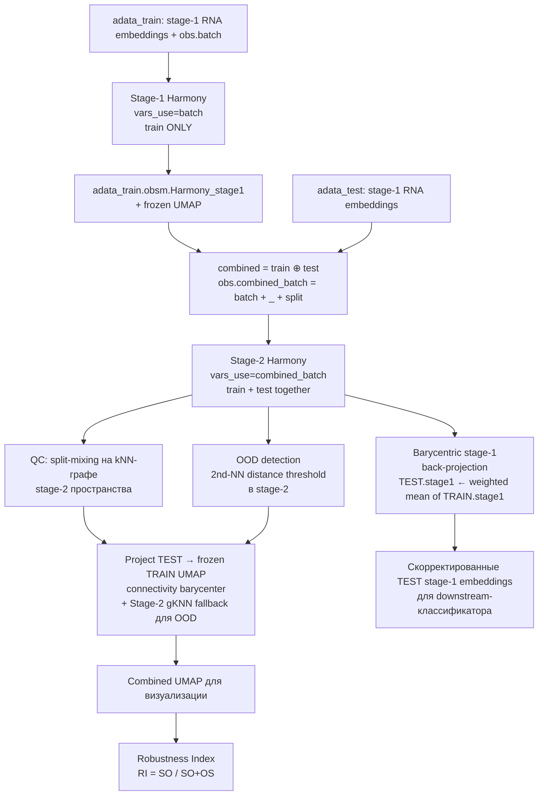
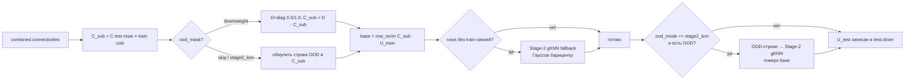

# BackTrack Harmony Integration
## Context

**Зачем:** обучающие RNA-embeddings (Eurynome) содержат батч-эффекты — артефакты от разных датасетов/центров. Если применить Harmony напрямую к объединённой выборке `train + test`, тестовые координаты «утянут» обучающие, и downstream-классификатор столкнётся с нестабильным признаковым пространством. **BackTrack Harmony Integration** решает это так: train корректируется один раз и «замораживается», а test проецируется на замороженное train-пространство — как stage-2 эмбеддинг, так и UMAP-координаты, и stage-1 эмбеддинги (через barycentric back-projection).


---

Общая схема (Mermaid)



---

## Глоссарий ключей и колонок

| Имя | Где живёт | Что хранит |
|-----|-----------|-----------|
| `obs['batch']` | train, test | внутренний батч (датасет-источник) |
| `obs['split']` | train, test | `'train' / 'test' / 'validation'`, опционально префикс `'HO '` для holdout |
| `obs['combined_batch']` | combined | `f"{batch}_{split}"` — категория для Harmony stage-2 |
| `obsm[EMB_STAGE1_KEY]` | train, test | **сырые** stage-1 эмбеддинги (Eurynome) |
| `obsm[EMB_STAGE2_OUT]` | train, test, combined | результат Harmony stage-2 |
| `obsm[UMAP_TRAIN_KEY]` | train (frozen), test (projected) | UMAP-координаты, посчитанные **на train** |
| `obs['qc_mix_score']` | combined | доля соседей с другим split в kNN |
| `obs['stage2_ood']` | test | булев флаг OOD по 2nd-NN distance |

---

## Шаг 1 — Stage-1 Harmony на train (только batch)

**Интуиция:** сначала убираем технический батч-эффект внутри train. Test пока не трогаем — иначе утечка.

```python
from batchcor_rna_emb.batch_correction.harmony import run_harmony_stage1

EMB_STAGE1_KEY = "Eurynome_rna_embeddings_EU-cbR.HE.1.1.0"

corrected = run_harmony_stage1(
    adata_train,
    embedding_key=EMB_STAGE1_KEY,
    batch_col="batch",
    max_iter=10,
)
adata_train.obsm[f"{EMB_STAGE1_KEY}_Harmony"] = corrected
```

**Внутри функции:** `harmonypy.run_harmony(data_mat, meta_data, vars_use=['batch'])` + аккуратный transpose `Z_corr` (harmonypy возвращает `(features, obs)`).

---

## Шаг 2 — заморозка train UMAP

**Интуиция:** UMAP-координаты train фиксируются. Любое тестовое наблюдение позже будет «приклеено» к этим точкам, а не пересчитано.

```python
import scanpy as sc
import numpy as np

# сортируем эмбеддинги по убыванию дисперсии (для стабильности elbow-plot/PC-выбора)
emb = adata_train.obsm[f"{EMB_STAGE1_KEY}_Harmony"]
order = np.argsort(np.var(emb, axis=0))[::-1]
adata_train.obsm[f"{EMB_STAGE1_KEY}_Harmony"] = emb[:, order]

sc.pp.neighbors(adata_train, use_rep=f"{EMB_STAGE1_KEY}_Harmony", n_pcs=42)
sc.tl.umap(adata_train, min_dist=0.4, spread=1.0, key_added="UMAP_Harmony_")
```

**Замечание:** `n_pcs=42` — выбирается по elbow-plot дисперсий после Harmony stage-1.

---

## Шаг 3 — combined AnnData с `combined_batch`

**Интуиция:** stage-2 Harmony должен видеть и `batch`, и факт того, что наблюдение из train или test. Поэтому метка склеивается: `combined_batch = batch_split`.

```python
# модуль: batchcor_rna_emb.batch_correction.harmony._make_combined
combined = _make_combined(
    adata_train, adata_test,
    batch_col="batch",
    split_col="split",
    obsm_keys=(EMB_STAGE1_KEY, EMB_STAGE2_OUT, UMAP_TRAIN_KEY),
)
# combined.obs['combined_batch'] = '<batch>_<split>'
# combined.X — placeholder zeros (RAM-light)
# combined.uns['rows'] = {'train': slice(...), 'test': slice(...)}
```

**Почему placeholder X:** генная матрица не нужна, копировать дорого. Все данные живут в `.obsm`.

---

## Шаг 4 — Stage-2 Harmony на склеенных эмбеддингах

**Интуиция:** ещё один прогон Harmony, но уже на `[train; test]`, с группировкой по `combined_batch`. Это «стягивает» однотипные диагнозы из train и test, не теряя биологию.

```python
# внутри backtrack_harmony_integration:
_run_harmony_stage2(
    adata_train, adata_test, combined,
    stage2_input_key=EMB_STAGE1_KEY,          # вход — сырые stage-1 (НЕ stage-1-Harmony)
    stage2_output_key=EMB_STAGE2_OUT,         # 'Embeddings_Harmony_Stage_2'
    max_iter=20,
)
# результат пишется в train.obsm, test.obsm и combined.obsm
```

**Тонкость:** stage-2 берёт исходные stage-1 эмбеддинги, не уже-скорректированные на шаге 1. Stage-1 Harmony нужен только чтобы получить **frozen UMAP** train. Stage-2 — отдельный прогон.

---

## Шаг 5 — QC: split-mixing score

**Интуиция:** если test и train хорошо перемешаны в stage-2 пространстве, то у соседей по kNN должен попадаться «чужой» split. Считаем долю чужих соседей на каждое наблюдение.

```python
qc = _qc_split_mixing(
    combined,
    rep_key=EMB_STAGE2_OUT,
    split_col="split",
    n_neighbors=30,
    metric="cosine",
)
# qc['mean_mix_overall'] ≈ 0.5 — идеально перемешано
# qc['mean_mix_by_split'] — по сплитам отдельно
```

Граф соседей сохраняется в `combined.obsp['connectivities']` — он ещё пригодится для проекции UMAP (шаг 7).

---

## Шаг 6 — OOD detection по 2nd-NN distance

**Интуиция:** для каждого train-наблюдения берём расстояние до 2-го ближайшего соседа (1-й — он сам). Получаем эмпирическое распределение «нормальных» расстояний внутри train. Высокий квантиль (`q=0.995`) — порог. Тестовое наблюдение, у которого расстояние до ближайшего train-соседа выше порога — OOD.

```python
ood_mask, ood_stats = _compute_ood_mask(
    adata_train, adata_test,
    stage2_key=EMB_STAGE2_OUT,
    metric="cosine",
    ref_k=2,
    q=0.995,
    factor=1.0,
)
adata_test.obs["stage2_ood"] = ood_mask
# ood_stats['pct_ood'] — сколько процентов test ушло в OOD
```

**Зачем:** на следующем шаге OOD-наблюдения проецируем не connectivity-барицентром (в кластер train), а Stage-2 gKNN — относительно ближайших train, чтобы не «впихивать» новинки в чужой кластер.

---

## Шаг 7 — проекция test → замороженный train UMAP

**Идея:** `U_test = row_normalized(C[test, train]) @ U_train`, где `C` — kNN-connectivities из шага 5.



```python
proj = _project_test_to_train_umap(
    adata_train, adata_test, combined,
    stage2_key=EMB_STAGE2_OUT,
    umap_train_key="UMAP_Harmony_",
    k_fallback=30,
    metric="cosine",
    ood_mask=ood_mask,
    ood_mode="stage2_knn",   # рекомендуемый режим для holdout/OOD
)
```

**Три режима OOD:**

| `ood_mode` | Поведение |
|-----------|-----------|
| `'downweight'` | мягко уменьшает связь OOD-наблюдений с train в `C_sub` (×0.5) |
| `'skip'` | обнуляет `C_sub` для OOD; они идут только в gKNN-fallback |
| `'stage2_knn'` | OOD-строки **всегда** размещаются Stage-2 gKNN — даже если есть train-связи. **Дефолт для holdout-датасетов.** |

**gKNN fallback (`_gknn_fallback`):** для строк без train-связей — k ближайших train в Stage-2, веса по гауссу с адаптивной σ = `median(d_i)` per-row, барицентр по `U_train`.

---

## Шаг 8 — barycentric back-projection stage-1 эмбеддингов

**Зачем:** stage-2 — внутреннее пространство Harmony, не для downstream-классификатора. Классификатор обучен на stage-1 эмбеддингах. Поэтому test stage-1 «подтягиваем» к train stage-1 через те же соседства, что в Stage-2.

```python
from batchcor_rna_emb.batch_correction.harmony import barycentric_stage1_embeddings

bary = barycentric_stage1_embeddings(
    adata_train, adata_test,
    stage1_key=EMB_STAGE1_KEY,        # перезаписываем сырые test stage-1 (write_key=None)
    stage2_key=EMB_STAGE2_OUT,        # соседство ищем в Stage-2
    k=30,
    metric="cosine",
    adaptive_sigma=True,              # σ_i = median(d_i)
    write_key=None,
)
```

**Формула на одну точку test j:**
```
neighbors = kNN_in_Stage2(Z_te[j], Z_tr, k)       # индексы train
d         = distances_in_Stage2(...)
σ_j       = median(d) + ε                          # адаптивная сигма
w_i       = exp(-d_i² / 2σ_j²),  Σ w_i = 1
E_te[j]   = Σ w_i * E_tr[neighbors[i]]            # барицентр в stage-1
```

**Результат:** `adata_test.obsm[EMB_STAGE1_KEY]` — скорректированные stage-1 эмбеддинги, лежащие «там же, где жили бы соответствующие train-наблюдения».

---

## Шаг 9 — Robustness Index (валидация)

**Идея:** хорошее эмбеддинг-пространство — то, где соседи по биологии (`diagnosis`) разнообразны по конфаундеру (`combined_batch`). Считаем kNN на финальном UMAP:

- **SO** — same biology, other confounder (хорошо)
- **OS** — other biology, same confounder (плохо)
- **RI = SO / (SO + OS)** ∈ [0, 1], выше — лучше

```python
from batchcor_rna_emb.batch_correction.harmony import robustness_index

ri, det = robustness_index(
    combined,
    emb_key="X_umap",          # склеенный train+test UMAP
    bio_key="diagnosis",
    conf_key="combined_batch",
    k=50,
    metric="euclidean",
)
# ri ≈ 0.6+ — батч-эффект в значительной мере убран
```

В нотбуке (`harmony_backtrack.ipynb`, ячейка `In[22]`) есть расширенная версия с расчётом `ri_no_holdout` — RI без holdout-наблюдений (`split` начинается с `"HO "`). Полезно для отчёта.

---

## End-to-end: оркестратор

Всё, что описано выше, склеено в одной функции:

```python
from batchcor_rna_emb.batch_correction.harmony import (
    run_harmony_stage1,
    backtrack_harmony_integration,
    barycentric_stage1_embeddings,
    robustness_index,
)

# 1) stage-1 Harmony на train + frozen UMAP (вручную, см. шаги 1-2)
adata_train.obsm["Harmony_stage1"] = run_harmony_stage1(adata_train, EMB_STAGE1_KEY, "batch")
sc.pp.neighbors(adata_train, use_rep="Harmony_stage1", n_pcs=42)
sc.tl.umap(adata_train, key_added="UMAP_Harmony_")

# 2) BackTrack: stage-2 + QC + OOD + проекция UMAP (всё внутри одной функции)
combined, diag = backtrack_harmony_integration(
    adata_train, adata_test,
    embedding_key=EMB_STAGE1_KEY,
    batch_col="batch",
    split_col="split",
    umap_train_key="UMAP_Harmony_",
    stage2_output_key="Embeddings_Harmony_Stage_2",
    qc_neighbors=30,
    ood_q=0.995,
    ood_mode="stage2_knn",
    k_fallback=30,
)

# 3) RI для отчёта
ri, det = robustness_index(combined, emb_key="X_umap")
```

`backtrack_harmony_integration` уже включает в себя шаги 3-8. После её вызова:
- `adata_train.obsm["UMAP_Harmony_"]` — не тронут (заморожен)
- `adata_test.obsm["UMAP_Harmony_"]` — спроецирован на train UMAP
- `adata_test.obsm[EMB_STAGE1_KEY]` — barycentric-скорректированные stage-1 эмбеддинги
- `combined.obsm["X_umap"]` — `vstack([train_umap, test_umap])` для отрисовки
- `diag` — словарь `{qc, ood, projection}` со статистиками для отчёта

---

## Критические моменты («где легко наступить»)

1. **Транспонирование `Z_corr`.** `harmonypy.run_harmony()` иногда возвращает `(n_features, n_obs)`, иногда `(n_obs, n_features)`. Все функции модуля делают проверку `Zc.shape[0] != Z_all.shape[0]` и транспонируют — копируйте этот паттерн при ручных модификациях.

2. **Не путать stage-1 Harmony и stage-2 input.** Stage-1 Harmony нужен **только** для frozen UMAP. Stage-2 принимает **сырые** stage-1 эмбеддинги (`EMB_STAGE1_KEY`, не `_Harmony`-суффикс). Это видно в `backtrack_harmony_integration`: `stage2_input_key=embedding_key` (исходный ключ).

3. **`combined.X` — placeholder.** Не пытайтесь читать матрицу экспрессии из combined — её там нет (zeros 1 колонка). Это сделано ради RAM. Все данные — в `.obsm`.

4. **Holdout-наблюдения.** Если у тебя есть holdout-датасеты, помечай их `split` префиксом `"HO "` (с пробелом). `_project_test_to_train_umap` автоматически добавит их в OOD-маску.

5. **Зерно для воспроизводимости.** `harmonypy` детерминирован при фикс. `random_state`, но `sc.tl.umap` — нет. Передавай `random_state` явно.

6. **Утечка между train/validation.** Validation должен идти как `adata_test_validation = ad.concat([adata_test, adata_validation])` (см. ячейку `In[17]` нотбука), и затем подаваться в `backtrack_harmony_integration` как «test». Иначе посчитаешь UMAP на validation, а это уже не frozen.

---

## Файлы, к которым обращаться

| Что | Путь |
|-----|------|
| Реализация (рабочая) | `batchcor_rna_emb/batch_correction/harmony.py` |
| Референс (нотбук) | `references/harmony_backtrack.ipynb` (копия в `.claude/harmony_backtrack.ipynb`) |
| Нотбук с применением | `notebooks/1.batch_correction.ipynb` |
| Колонки obs / структура AnnData | `references/data_exch_str.md` |
| Описание задачи (контекст проекта) | `references/project_descr.md` |

---

## Verification (как проверить, что всё работает)

1. **Размерности:**
   ```python
   assert adata_train.obsm[EMB_STAGE1_KEY].shape[0] == adata_train.n_obs
   assert adata_test.obsm[EMB_STAGE1_KEY].shape[1] == adata_train.obsm[EMB_STAGE1_KEY].shape[1]
   assert adata_train.obsm["UMAP_Harmony_"].shape == (adata_train.n_obs, 2)
   ```

2. **QC-метрика batch-mixing:** после `backtrack_harmony_integration` ожидаем `diag['qc']['mean_mix_overall']` ≈ 0.4–0.6 (зависит от реальной структуры).

3. **Визуальный sanity-check:**
   ```python
   sc.pl.embedding(combined, basis="X_umap", color=["split", "batch", "diagnosis"], s=5)
   ```
   - `split` — train и test должны перемешиваться
   - `batch` — батчи без выраженных кластеров
   - `diagnosis` — биологические кластеры **сохраняются**

4. **Robustness Index:**
   ```python
   ri, _ = robustness_index(combined, emb_key="X_umap")
   assert ri > 0.5, "RI должен быть выше 0.5 после коррекции"
   ```

5. **Регрессия по downstream-задаче.** Финальная проверка — обучить классификатор на скорректированных stage-1 (test.obsm[EMB_STAGE1_KEY]) и сравнить F1/ROC-AUC с baseline без коррекции. Это тема ноутбука `2.metrics_modeling_stress_test.ipynb`.

---

## Reasoning Summary

BackTrack Harmony Integration — это асимметричный пайплайн: train проходит через Harmony stage-1 + frozen UMAP, test проецируется на это пространство тремя путями (Stage-2 Harmony, connectivity-barycenter UMAP-проекция, gKNN barycentric back-projection stage-1 эмбеддингов). Ключевая идея — никогда не пересчитывать train-пространство при поступлении новых данных, чтобы downstream-классификатор работал в стабильном признаковом пространстве. Все функции уже реализованы в `batchcor_rna_emb/batch_correction/harmony.py` — студенту нужно лишь вызвать `run_harmony_stage1` + `backtrack_harmony_integration` + `robustness_index`.
